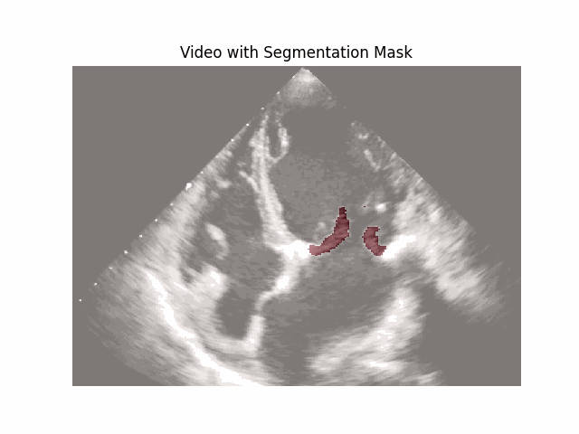
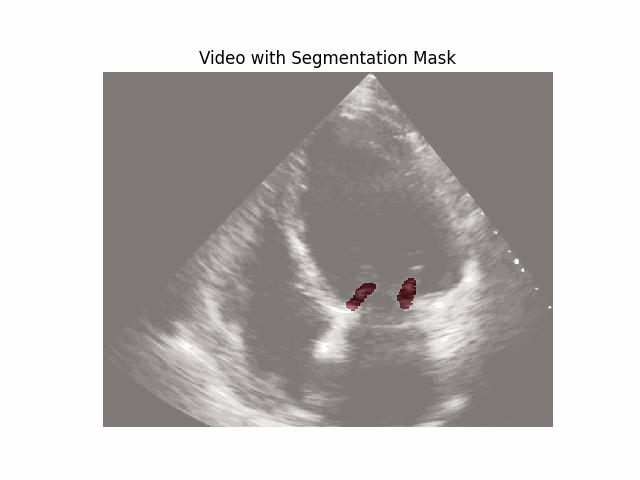
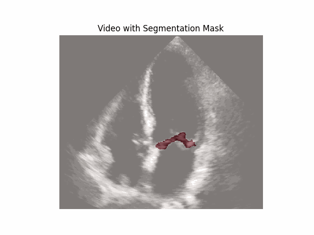

# Mitral Valve Segmentation (AML Task 3)

Team project for the Advanced Machine Learning course. We finished **2nd out of 147 teams** on the in-class Kaggle competition.

Team: Ambroise Aigueperse, Tunaberk Almaci, Thomas Zamblera.

## Task

The mitral valve (MV) is the largest valve of the heart, regulating blood flow between the left atrium and the left ventricle. It is made up of two leaflets (anterior and posterior) attached to the mitral annulus. Echocardiography produces 2D ultrasound videos of the heart and is the standard clinical tool for diagnosing MV disease; automatic MV segmentation is a first step toward supporting diagnosis, surgical planning, and intra-operative guidance.

The task was to segment the mitral valve in echocardiography videos.

- **Training set**: 65 videos, each with the MV labeled in 3 frames, plus a bounding box around the MV per video. Videos come from two sources: high-resolution recordings labeled by experienced cardiologists ("expert"), and lower-resolution recordings labeled by non-experts ("amateur"). Both are present in training; the test set is evaluated on expert labels only.
- **Test set**: 20 videos, every frame needs a predicted MV segmentation.
- **Submission format**: run-length-encoded boolean masks, one row per contiguous run of `1`s in the flattened mask (`id`, `value` columns; `value` is `[flattenedIdx, len]`).
- **Metric**: median Jaccard index (IoU) over all test videos.

## Approach

With only 195 labeled frames total, data augmentation was central to the approach:

1. **Repetition**: the (small) dataset was repeated to artificially inflate epoch size, which also let us keep batch sizes small enough to fit in GPU memory.
2. **Extra channels**: alongside the raw frame, we added a blurred channel, a denoised channel, and an edge channel — all cues that seemed relevant to delineating the valve.
3. **Geometric augmentation**: a further pipeline of rotations, shear, zoom, etc. was applied on top.

We tried several segmentation architectures and, after multiple rounds of experimentation, settled on an ensemble of four:

- **UNet++**
- **DeepLabV3+**
- **FPN**
- **EfficientNet-UNet++**

After hyperparameter tuning, single models scored between 0.51 and 0.54 IoU at an image size of 256. The biggest single improvement came from training at **512×512** instead of 256×256, much closer to the true resolution of the expert frames — slower to train, but worth it.

Final predictions aggregate the four models' outputs through a voting scheme, followed by light post-processing (smoothing and hole-filling), which fit the smooth, closed-contour nature of the valve leaflets.

## Example predictions

Predicted masks (post voting/post-processing) overlaid on test videos:

  
  
  

## Room for improvement

- **Crop to the bounding box before feeding the model**, instead of only applying it as a post-hoc mask on the full-frame prediction. We already had per-video bounding boxes (`bounding_boxes.json`); running the models on the cropped region would let them spend their full resolution budget on the valve itself rather than on background, which should help most at 256×256 and could let us get 512×512-level detail without the memory/speed cost of full-frame 512×512 training.
- **A more principled post-processing step.** Our smoothing/hole-filling was fairly generic; the mitral valve has real physical priors we didn't encode — the leaflets form a smooth, thin, roughly single-connected-component structure across a cardiac cycle, and motion between consecutive frames is continuous. A method that enforces smooth leaflet contours (e.g. active contours/snakes, an explicit shape prior, or a small elastic constraint between the two leaflets) and temporal consistency across frames (rather than segmenting each frame independently) would likely fix a lot of the remaining local errors post-ensembling.

## Repository contents

- `task3.ipynb` — the main notebook: data loading, augmentation, model definitions/training calls, ensembling, and submission generation. This is the notebook that produced our final submissions.
- `reformat_submission.py` — small helper to post-process a generated submission CSV (e.g. dropping/replacing rows for a specific video).
- `.gitignore` — excludes model weights (`*.pth`), the provided `train.pkl`/`test.pkl`/`sample.csv`, generated `submission*.csv` files, and debug animation GIFs, none of which belong in version control.

Model weights, the raw `train.pkl`/`test.pkl` data, and generated submission CSVs are not tracked in this repository (see `.gitignore`). Training was run on a university compute cluster, not locally.
